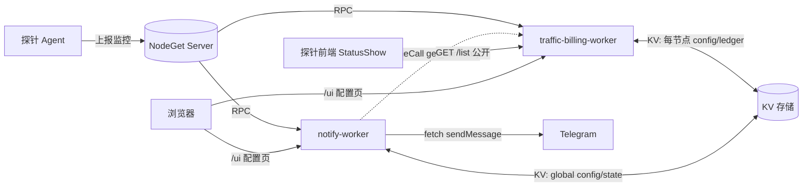

# NodeGet 流量监控 & 消息通知 · js-worker 套件

> **仓库地址**: <https://github.com/laozig/js_workers>

为 [NodeGet](https://nodeget.com) 探针面板开发的两个 **js-worker** + 配套 **Dashboard 扩展**,完全运行在 NodeGet 边缘端(Server 内嵌的 QuickJS Runtime),**不改探针 agent 任何代码**。

| Worker | 作用 | route_name | 扩展入口 |
|---|---|---|---|
| `traffic-billing-worker.js` | 逐台 opt-in 的**流量记账** + 配额阶梯告警 + 对外汇总 | `traffic-billing` | 流量监控(全局 + 每节点页) |
| `notify-worker.js` | 节点**离线/上线/到期/流量超额** → Telegram 通知 | `notify` | 消息通知(全局) |

**特性**:单文件部署 · 内置配置 UI · 登录保护 · Telegram 推送 · 探针前端原生集成 · 缺一不可降级(notify 在 traffic 没装时照常跑离线/到期)。

---

## 🚀 快速上手(5 分钟)

> 只想先跑起来看这一节;字段细节、排错、安全见下文。

**① 流量监控**
1. **JS Worker → 新建** `traffic-billing-worker`,贴 [traffic-billing-worker.js](traffic-billing-worker.js) → **保存代码**
2. 打开「**设置**」→ 「**路由**」框填 `traffic-billing`(这一项就是 route_name);「**环境变量**」加一条 `token` = 你的 NodeGet 平台 Token
3. **定时任务 → 创建定时任务**(⚠️ 必做):Task 类型 = **Server 任务**,Server 任务类型 = **JS Worker**,Worker Name = `traffic-billing-worker`,Cron = `0 */5 * * * *`,Parameters 留 `{}`
4. (可选)**扩展管理** 装 `traffic-monitor-extension.zip`(需本地打包,见下方「扩展打包」) → 点「流量监控」→ 给机器开监控、设配额

**② 消息通知**
1. **JS Worker → 新建** `notify-worker`,贴 [notify-worker.js](notify-worker.js) → **保存代码**
2. 打开「**设置**」→ 「**路由**」框填 `notify`;「**环境变量**」加一条 `token` = 你的 NodeGet 平台 Token
3. **定时任务 → 创建定时任务**(⚠️ 必做):Task 类型 = **Server 任务**,Server 任务类型 = **JS Worker**,Worker Name = `notify-worker`,Cron = `0 */2 * * * *`,Parameters 留 `{}`
4. 装 `notify-extension.zip`(需本地打包) → 点「消息通知」→ 开总开关、填 Telegram **Bot Token / Chat ID**、勾事件、**保存** → 点「发送测试消息」验证

**③ (可选)加访问密码**:给两个 worker 在「**环境变量**」各加一条 `route_secret` = 一串随机字符(相当于配置页的登录密码)。设了之后打开配置页要先输入它登录,本机记住、以后免输;不设则知道地址的人就能打开。详见下方「安全」。

> ⚠️ **两个最容易踩的坑**:① **必须建定时任务**,否则流量不累计、通知不检测;② env 里的 `token` 是 **NodeGet 平台 Token**,**不是** Telegram bot token。

---

## 目录结构

```
Js-Worker/
├── traffic-billing-worker.js              # 流量记账 worker(单文件,含内置 UI)
├── traffic-billing-worker.description.md   # 该 worker 的 Dashboard 描述(Markdown)
├── notify-worker.js                        # 通知 worker(单文件,含内置 UI)
├── notify-worker.description.md            # 该 worker 的 Dashboard 描述(Markdown)
│
├── extension/                              # 「流量监控」Dashboard 扩展(前端壳)
│   ├── app.json                            #   扩展清单(name/routes/icon)
│   └── resources/
│       ├── index.html                      #   跳转壳:同源跳到 worker 的 /ui
│       └── assets/icon.svg                 #   侧边栏图标(主题自适应:亮黑暗白)
├── notify-extension/                       # 「消息通知」Dashboard 扩展(同结构)
│   ├── app.json
│   └── resources/{index.html, assets/icon.svg}
│
└── ...                                     # (打包好的 zip 已移至 .gitignore,需本地打包)
```

> **扩展只是前端壳**(`limits` 为空、不需要任何权限):打开后同源跳转到对应 worker 的 `/ui` 页面,数据读写全部由 worker 用自身 `env.token` 完成。worker 与扩展是两套东西,**worker 靠「保存代码」部署,扩展靠「扩展管理 → 安装」**。

---

## 架构 / 数据流



- 两个 worker 各自独立的**定时任务(cron)**驱动:traffic 每 5 分钟审计流量,notify 每 2 分钟检测事件。
- 关系是**单向松耦合**:notify 通过 `inlineCall` 读 traffic 的告警节点;traffic 完全不知道 notify 存在。
- 探针前端只读 traffic 的公开接口 `/list`;notify 无前端依赖。

---

## 🎨 配套前端主题(一键部署)

[NodeGet-StatusShow](https://laozig-statusshow.pages.dev) 是配套的探针前端主题(laozig 二开版),与 `traffic-billing-worker` **完美契合**:装上后,每台机器的卡片 / 表格会直接显示**本月已用流量、配额范围与占比**,数据实时取自 worker 的 `/list` 接口;worker 没部署时该行/列自动隐藏,不影响正常展示。

NodeGet 主控的「**主题管理**」支持填入一个**主题托管地址**,主控会自动去该地址拉取主题文件(`nodeget-theme.json` / `config.json` / `NodeGet-StatusShow.zip`,由 `npm run build` 的 `postbuild` 自动生成)。

> ⚠️ 一键部署需要**主控版本 ≥ 0.2.6**。请先到 [控制面板 → 节点管理 → 主控](https://dash.nodeget.com/#/dashboard/node-manage?tab=servers) 确认主控版本。

**一键添加本主题到主控:**

<a href="https://dash.nodeget.com/#/dashboard/theme-management?add=https://laozig-statusshow.pages.dev">
  
</a>

点击按钮即可在 NodeGet 主控添加 **laozig 二开主题**(拉取本主题最新版);添加后到「主题管理」启用即可。配合上面的 traffic-billing-worker,流量详情就会显示在每台机器的卡片上。

---

## 一、流量监控 · traffic-billing

### 功能
- **统计口径(重要)**:记的是**本计费周期(当月)内新产生的流量增量**,**不是**探针面板上「开机以来的累计总流量」。worker 每轮用探针累计计数器的**差值**累加,每到起算日把这个累计清零、从 0 重新算。所以你看到的「本月已用」就是这个月跑了多少,跟机器开了多久无关。
- 每台机器**单独开启、单独配置**(无默认配额)。
- 按**自然月**重置:每月到「起算日」当天的 0 点(**东八区,即北京时间 / UTC+8**)把本期已用清零、重新开始计。
  - 例:起算日设 `5`,则每月 5 号 0 点清零。
  - **短月自动落月末**:起算日设 `31`,但 2 月没有 31 号时,当月就按月末最后一天(28 / 29 号)重置,不会跳过这个月。
- 计费方向:出网(上传)/ 入网(下载)/ 双向。节点重启计数器归零自动容错。
- 配额留空 = 只统计不告警;填数字 → 80% 起**每 +5% 一个档位**输出,供 notify 阶梯报警。
- 内置配置页:汇总卡片、搜索、排序、标签筛选、批量开关/设配额/重置。

### 部署
1. **JS Worker → 新建**,名称 `traffic-billing-worker`,把 `traffic-billing-worker.js` 全文贴进代码框 → **保存代码**。
2. **设置 → 路由(route_name)**:填 `traffic-billing`。这决定访问地址 `/nodeget/worker-route/traffic-billing/…`;改了要同步改扩展壳 `index.html` 里的跳转地址。
3. **环境变量**:见下表。
4. **定时任务 → 创建定时任务**(⚠️ **必须建,否则用量永远不累计、到点不重置**):
   - **名称**:任意(可填 `traffic-billing-worker`)
   - **Cron 表达式**:`0 */5 * * * *`(每 5 分钟)
   - **Task 类型**:`Server 任务`
   - **Server 任务类型**:`JS Worker`
   - **Worker Name**:`traffic-billing-worker`
   - **Parameters (JSON)**:`{}`
5. (可选)**扩展管理 → 安装** `traffic-monitor-extension.zip`。

### 环境变量
| 键 | 必填 | 说明 |
|---|---|---|
| `token` | ✅ | NodeGet 平台 Token(读 agent/动态摘要 + KV 读写;cron 还需 `JsWorker::RunDefinedJsWorker`) |
| `route_secret` | 可选 | **配置页的访问密码**,随便填一串随机字符(建议 ≥24 位,例如截图里的 `sn5diPh…`)。设了之后打开 `/ui` 要先输入它登录(本机记住、以后免输);不设则任何人知道地址就能打开配置页。`/list`、`/summary` 数据接口不受影响、始终公开 |

### onCall / onInlineCall(`params.action`)
| action | 参数 | 说明 |
|---|---|---|
| `list` | — | 所有节点记账视图 |
| `get_summary` | — | 汇总 + `alerting:[{uuid,name,percent,level}]` |
| `get_config` | `{uuid}` | 读单节点配置 |
| `set_config` | `{uuid,enabled?,billing_day?,mode?,quota_gb?}` | 改配置 |
| `audit_now` | — | 立即审计一轮 |
| `reset_node` | `{uuid}` | 重置本期已用 |

### HTTP 路由(`/nodeget/worker-route/traffic-billing`)
| 方法 路径 | 鉴权 | 说明 |
|---|---|---|
| `GET /ui` | 公开(出登录页) | 配置页 |
| `GET /list`、`/summary` | **公开** | 数据接口,前端拉取 |
| `GET /config?uuid=` / `POST /config` | 需登录 | 读/改配置 |
| `POST /audit` / `POST /reset` `{uuid}` | 需登录 | 审计 / 重置 |

### 前端集成
探针前端 `NodeGet-StatusShow` 已原生集成:卡片底部 / 表格列显示「本月流量」,数据取自 `/list`。worker 没部署时前端**自动隐藏该行/列**,不影响正常显示。

---

## 二、消息通知 · notify

### 功能
- 事件:**离线 / 上线 / 到期 / 流量超额**,Telegram 推送(对齐 Komari)。
- 离线判定 90 秒无上报;同一轮多台离线/恢复**合并成一条**;发送失败下轮重试。
- 到期:`metadata_expire_time` ≤ N 天(默认 7),**每天提醒一次**(跨天重发,续费即停)。
- 流量超额:`inlineCall` traffic-billing,80% 起每 +5% 档位报一次。
- 内置配置页:总开关、消息模板、Telegram 设置、事件勾选、测试、立即检测、上次检测时间。

### 部署
1. **JS Worker → 新建**,名称 `notify-worker`,贴 `notify-worker.js` → **保存代码**。
2. **设置 → 路由(route_name)**:填 `notify`。访问地址 `/nodeget/worker-route/notify/…`。
3. **环境变量**:见下表。
4. **定时任务 → 创建定时任务**(⚠️ **必须建,否则永远不检测离线/到期,只有手动「立即检测」会跑**):
   - **Cron 表达式**:`0 */2 * * * *`(每 2 分钟)
   - **Task 类型**:`Server 任务`
   - **Server 任务类型**:`JS Worker`
   - **Worker Name**:`notify-worker`
   - **Parameters (JSON)**:`{}`
5. 打开 `/ui` → 开总开关、填 Telegram Bot Token / Chat ID、勾事件、保存。
6. (可选)安装 `notify-extension.zip`。

### 环境变量
| 键 | 必填 | 说明 |
|---|---|---|
| `token` | ✅ | NodeGet 平台 Token(读 agent/KV)。⚠️ **不是** Telegram bot token |
| `route_secret` | 可选 | **配置页的访问密码**,随机字符串即可(建议 ≥24 位)。设了后打开 `/ui` 要先登录(本机记住);不设则知道地址即可打开 |

> Telegram 的 `bot_token` / `chat_id` 在 `/ui` 页面里填,**不在** env。

### onCall / onInlineCall(`params.action`)
| action | 参数 | 说明 |
|---|---|---|
| `get_config` | — | 读配置(`bot_token` 打码)+ 状态 |
| `set_config` | `{config:{...}}` | 改配置(`bot_token` 留空=保留原值) |
| `test` | — | 发测试消息 |
| `run` | — | 立即检测一轮 |
| `get_state` | — | 读运行状态(`last_run` 等) |

### HTTP 路由(`/nodeget/worker-route/notify`)
| 方法 路径 | 鉴权 | 说明 |
|---|---|---|
| `GET /ui` | 公开(出登录页) | 配置页 |
| `GET /config` | 需登录 | 读配置(打码)+ 状态 |
| `POST /config` / `/test` / `/run` | 需登录 | 保存 / 测试 / 检测 |

### 消息模板变量
`{{emoji}}` · `{{event}}` · `{{client}}`(节点名) · `{{time}}`(CST) · `{{type}}`

---

## 安全:登录保护方案

> NodeGet 的 `worker-route` 是**公开 HTTP 端点**(平台无账号级鉴权,官方文档确认)。下面是 worker 自己实现的**应用层登录**。

- **不设 `route_secret`** → 公开,打开 `/ui` 即用。
- **设了 `route_secret`** → 打开 `/ui` 先出**登录页**:
  - 输入密钥 → 校验通过 → 进入,并**本机记住**(`localStorage`:`ng_s_traffic` / `ng_s_notify`);
  - 以后点扩展图标**直接进**(记住了);
  - 没登录 / 密钥错 → 只看到登录框,**读不到任何配置数据**(数据接口返回 401);
  - 也可用 `…/ui#s=<密钥>` **免登录直达**(`#` hash 不发服务器,不进日志,适合存书签)。
- **密钥走 `x-route-secret` 请求头**传输(不进 URL / 反代日志 / 浏览器历史),并天然防 CSRF。
- **`bot_token` 打码**:配置页只回显尾巴提示(如 `12345…wXyz`);保存时留空=保留原值。
- **数据接口例外**:traffic 的 `/list`、`/summary` 始终公开(探针前端要拉),只读用量数字、不含凭证。

**强度说明**:这是"知道密钥的人能进"的应用层登录,不是账号级鉴权。请用 **≥24 位随机串**作 `route_secret` 防爆破。

---

## 扩展(Dashboard Extension)

`app.json` 关键字段:

```jsonc
{
  "name": "traffic-monitor",          // 扩展唯一名
  "routes": [
    { "type": "global", "name": "流量监控", "entry": "index.html" },
    { "type": "node",   "name": "流量监控", "entry": "index.html" }  // 每台机器页也有入口
  ],
  "limits": [],                        // 空 = 扩展不需要任何权限
  "icon": "assets/icon.svg"            // 主题自适应:亮色黑线 / 暗色白线
}
```

- `type: global` → 出现在「应用扩展」区;`type: node` → 每台机器详情页也有入口(traffic 用,带 `#node=<uuid>` 自动定位高亮)。
- 壳 `index.html` 跳转到 `/nodeget/worker-route/{route_name}/ui`。**改了 worker 的 `route_name`,要同步改壳里的跳转地址**。
- 安装:扩展管理 → 安装 → 选 `*-extension.zip` 或对应文件夹。

---

## 扩展打包

扩展源码在 `extension/` 和 `notify-extension/` 目录,zip 文件已从仓库移除。本地打包:

```bash
# 流量监控扩展
cd extension && zip -r ../traffic-monitor-extension.zip . && cd ..

# 消息通知扩展
cd notify-extension && zip -r ../notify-extension.zip . && cd ..
```

打包后在 NodeGet「扩展管理 → 安装」即可。

---

## KV 存储

| Worker | 命名空间 | Key | 内容 |
|---|---|---|---|
| traffic | 每节点 `<uuid>` | `traffic_billing_config` | `{enabled,billing_day,mode,quota_gb}` |
| traffic | 每节点 `<uuid>` | `traffic_billing_ledger` | `{snapshot:{...累计/告警/周期}}` |
| notify | `global` | `notify_config` | 通知配置(含 bot_token) |
| notify | `global` | `notify_state` | 离线/到期/流量状态 + `last_run` |

> 登录密钥**不在 KV**,只存访问者浏览器的 `localStorage`。

---

## 常见问题 / 排错

| 现象 | 原因 / 处理 |
|---|---|
| 面板看不到流量 / 不累计 | 没建 traffic 的**定时任务**,或机器没在 `/ui` 里开启监控 |
| 到期提醒"发出 0 条" | 该节点**今天已提醒过**(每天一次);或不在窗口内 |
| 通知完全不发 | notify 没建定时任务 / 没开总开关 / 事件没勾 / `bot_token`、`chat_id` 没填 |
| 流量超额不发 | 没勾「流量超额」事件,或 traffic-billing 未部署 / 未审计出 ≥80% |
| 配置页进不去(🔒) | 设了 `route_secret`:登录页输密钥,或用 `…/ui#s=<密钥>` |
| 打开 `/ui` 404 | 路径别带 `/rpc/`,正确是 `/nodeget/worker-route/<route_name>/ui` |
| 测试消息能发但检测不发 | 测试是手动的;检测靠**定时任务**,确认 cron 在跑(看 `/ui` 顶部「上次检测」) |

---

## 二次开发

- NodeGet worker 基于 **ES Module**,`export default { onCall, onInlineCall, onCron, onRoute }`,**不支持 `import`**;需要多文件就本地用 **esbuild 打包**(`bundle:true, format:"esm", minify:false, target:"es2022"`)。
- 全局能力:`nodeget(method, params)`(JSON-RPC)、`inlineCall(name, params, timeout?)`、`db`/`execSql`、`fetch`、`randomUUID`、标准 `Request`/`Response`/`URL` 等。
- `cron` 为 **6 段**(秒 分 时 日 月 周),例:`0 */2 * * * *` = 每 2 分钟。
- 每个 worker 可设 **`description`** 字段(`js-worker_create/update`),Dashboard 按 Markdown 渲染——本仓库 `*.description.md` 即为此准备,粘到「设置」的描述字段即可。
- 本地用 Node 跑 mock 测试:设 `globalThis.nodeget` / `globalThis.fetch` 桩,`import` worker 的 `default`,直接调 `onRoute`/`onCall`/`onCron` 断言。

## 参考
- NodeGet 文档:<https://nodeget.com/>(API / Dev / js-worker)
- 各 worker 的接口/参数详表见同名 `*.description.md`
- 扩展安装与使用见各 `extension/readme.md`、`notify-extension/readme.md`
